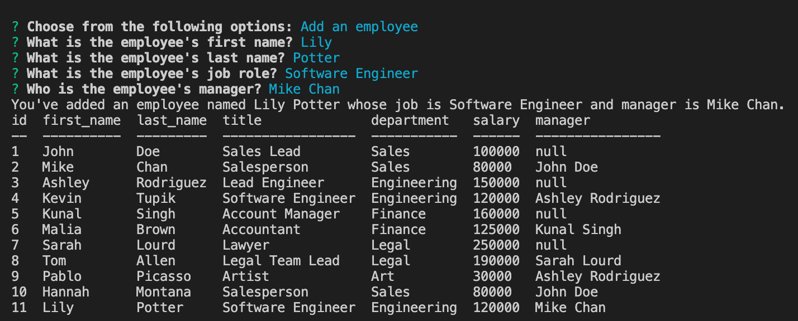

# Employee Tracker

## Application Description
This application interface is a content management system (CMS). It allows non-developers to easily view and interact with information in a database. In this case, if a manager wanted to interact with the employee, department, or job role information in the MySQL database, they can add, view, or update it via prompts in the terminal.  

## Challenge Description
The application is started using 'npm start' or 'node server.js' and uses the node modules of inquirer for prompts, mysql2 for adding table information, and console.table for displaying the tables to the user. The challenge required first building a mysql database via a schema and seeds which can be found in the db folder. The tables in this database include departments, roles, and employees. Some of the ids for each are primary keys and corresponding foreign keys for others. This way roles can be assigned departments, employees can be assigned roles, and employees can be assigned manager from other employees. To view these tables a simple select query method is used in the server.js JavaScript file. However to add and update information from the table, an array is used to pull data from the tables dynamically (since the information changes with each command) and then write that data from the array into newly generated tables via another insert query that passes string interpolated parameters. Each time information is added, the user is given confirmation in the console and then shown the new table information. Finally, the user can quit the application and given a thank you message. 

## User Story

```
AS A business owner
I WANT to be able to view and manage the departments, roles, and employees in my company
SO THAT I can organize and plan my business
```

## Acceptance Criteria

```
GIVEN a command-line application that accepts user input
WHEN I start the application
THEN I am presented with the following options: view all departments, view all roles, view all employees, add a department, add a role, add an employee, and update an employee role
WHEN I choose to view all departments
THEN I am presented with a formatted table showing department names and department ids
WHEN I choose to view all roles
THEN I am presented with the job title, role id, the department that role belongs to, and the salary for that role
WHEN I choose to view all employees
THEN I am presented with a formatted table showing employee data, including employee ids, first names, last names, job titles, departments, salaries, and managers that the employees report to
WHEN I choose to add a department
THEN I am prompted to enter the name of the department and that department is added to the database
WHEN I choose to add a role
THEN I am prompted to enter the name, salary, and department for the role and that role is added to the database
WHEN I choose to add an employee
THEN I am prompted to enter the employee’s first name, last name, role, and manager, and that employee is added to the database
WHEN I choose to update an employee role
THEN I am prompted to select an employee to update and their new role and this information is updated in the database
```

## Tasks Completed
The JavaScript documents include:
* functions, variables, objects
* conditional statements, arrays, queries, and string interpolation
* node modules such as Inquirer, MySql2, and Console.Table
* comments


## Languages
- JavaScript


## Links
* [Application Walkthrough Video](https://drive.google.com/file/d/1KTWOEwyQQSdrUgAcKb-xXisQM5x822gi/view)

* [Repository](https://github.com/villette0/M12C-Employee_Tracker)

## Screenshots




